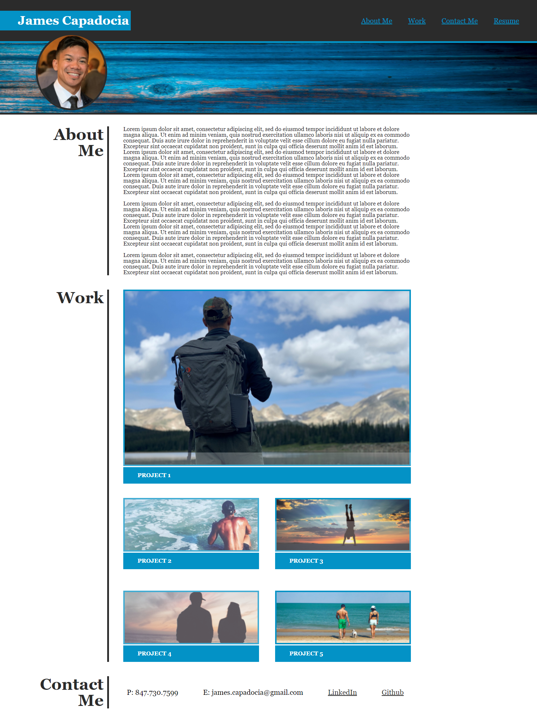

# My Portfolio Webpage

## Link to public repo on Github:

https://github.com/jcapadocia3/My-Personal-Portfolio

## Link to public Github page URL:

https://jcapadocia3.github.io/My-Personal-Portfolio/

## Final webpage project image:

## About Project

This project represents a portfolio webpage that a prospect may provide a company in a job application for a Web Delevoper position. It shows the prospect's ability to create a fully funtional webpage using HTML and CSS (complete with working links) and can portray that they are capable of completing any job requirement the position would task them to do. This webpage is also used to provide the company with a bit of information regarding the prospect and how he/she may be a good fit for the company.

### How the project functions

- The navigation bar portion at the top of the project is fully functional with links that will "jump" the user to the appropriate section of the page with the corresponding heading. The navigation bar also contains a link that will redirect the user to a completed Resume, in PDF format, for viewing/printing as needed.

- The main portion of the project contains an About Me section where the prospect can provide information about themselves and their qualifications for the role applied for.

- The main portion also contains a Work section complete with images, acting as links, to redirect the user to projects or applications he/she has built themselves that can be used as references for eligibility of the role.
    
    
 ***Please be advised, in it's current state, all images/links will redirect the user to the same exact working project/application to show that the links are are actually functional and that they are working as intended.*** 

- The footer portion of the project contains the Contact Me section which includes the prospect's phone number, email address, and working links to their public LinkedIn and Github pages.

## License
- Licensed under the [MIT License](LICENSE)
